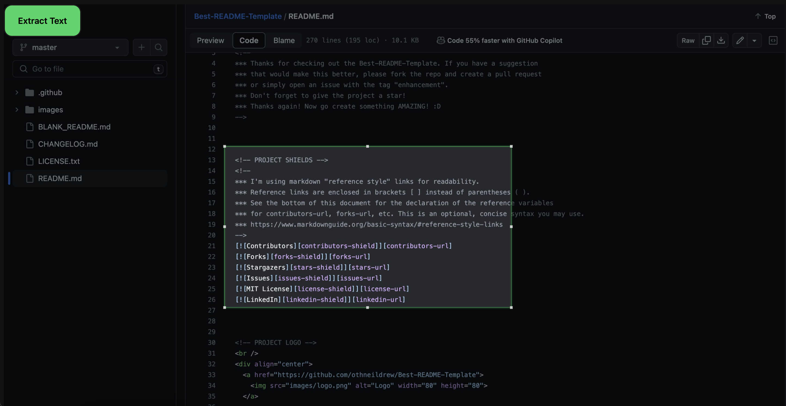

<a name="readme-top"></a>

<br />
<div align="center">

  


  <h3 align="center">Text Extracter Extension</h3>

  <p align="center">
    Ever wanted to copy something from a website? This extension allows you to copy text even when a website blocks it!
    <br />
    <br />
    <a href="#Usage">View Demo</a>
  </p>
</div>


<!-- TABLE OF CONTENTS -->
<details>
  <summary>Table of Contents</summary>
  <ol>
    <li>
      <a href="#about-the-project">About The Project</a>
      <ul>
        <li><a href="#built-with">Built With</a></li>
      </ul>
    </li>
    <li>
      <a href="#getting-started">Getting Started</a>
      <ul>
        <li><a href="#prerequisites">Prerequisites</a></li>
        <li><a href="#installation">Installation</a></li>
      </ul>
    </li>
    <li><a href="#usage">Usage</a></li>
    <li><a href="#roadmap">Roadmap</a></li>
    <li><a href="#contributing">Contributing</a></li>
    <li><a href="#license">License</a></li>
    <li><a href="#contact">Contact</a></li>
    <li><a href="#acknowledgments">Acknowledgments</a></li>
  </ol>
</details>


<!-- ABOUT THE PROJECT -->
## About The Project



<p align="right">(<a href="#readme-top">back to top</a>)</p>


### Built With

* <a href="https://www.javascript.com/">JavaScript</a>
* <a href="https://www.python.org/">Python</a>
* <a href="https://github.com/tesseract-ocr/tesseract">Tesseract OCR Engine</a>
* <a href="https://github.com/fengyuanchen/cropperjs">CropperJS</a>
<p align="right">(<a href="#readme-top">back to top</a>)</p>


<!-- GETTING STARTED -->
## Getting Started

### Prerequisites

* node version v18.16.1
* npm version 9.7.2
* Python 3.11.4

### Installation

_Below is an example of how you can instruct your audience on installing and setting up your app. This template doesn't rely on any external dependencies or services._

1. Clone the repo
   ```sh
   git clone https://github.com/srmoola/OCR-Screenshot-Extension.git
   ```
2. Install NPM packages
   ```sh
   npm install
   ```
3. Enter OCR_Engine Directory
   ```sh
   cd OCR_Engine
   ```

4. Install Python Dependencies
   ```sh
   pip install requirements.txt
   ```

5. <a href = "https://developer.chrome.com/docs/extensions/get-started/tutorial/hello-world#load-unpacked">Unpack Extension Manually</a>

6. Start Flask Server
   ```sh
    python main.py
   
     or
   
    python3 main.py
   ```

<p align="right">(<a href="#readme-top">back to top</a>)</p>


<!-- USAGE EXAMPLES -->
## Usage
<p id="Usage"></p>

Press Extension on any website and put the Crop Box around text you want. Then press the "Extract Text" button!

* Video Demo will be out soon!

<p align="right">(<a href="#readme-top">back to top</a>)</p>


<!-- CONTACT -->
## Contact

Satyadev Moolagani - smoolagani.dev@gmail.com

Project Link: [https://github.com/srmoola/OCR-Screenshot-Extension](https://github.com/srmoola/OCR-Screenshot-Extension)

<p align="right">(<a href="#readme-top">back to top</a>)</p>


<!-- ACKNOWLEDGMENTS -->
## Acknowledgments

* [CropperJS Example - Fengyuan Chen](https://github.com/fengyuanchen/cropperjs)

<p align="right">(<a href="#readme-top">back to top</a>)</p>
